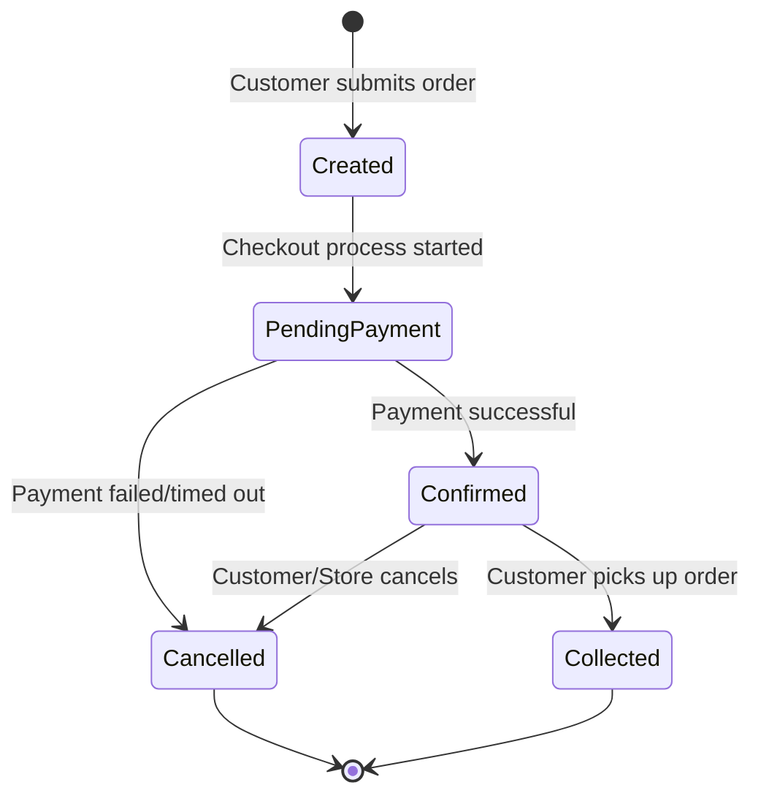
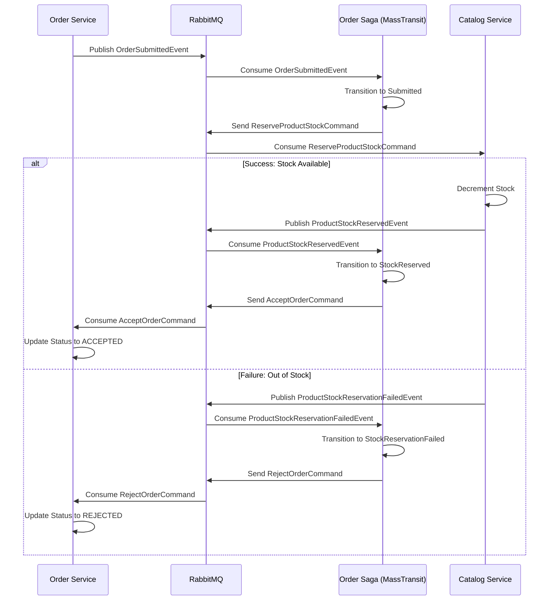

# AGENT.md — Grab&Go Microservices (MVP)

> This file is the authoritative architecture reference for AI agents (Claude Code, Copilot, etc.) and new engineers working on this codebase. Read it fully before making any changes.

---

## Project overview

**Grab&Go** is a food & grocery pickup platform built as a distributed system. For the MVP, we focus on **3 core microservices**. The backend is written in **C# / .NET 8** using **ASP.NET Core** Web APIs. Services communicate asynchronously via **RabbitMQ** (MassTransit) and synchronously through the **Ocelot API Gateway**.

## Service documentation URL

All service documentation is unified under a single URL:
`/docs/services`

### Service map (MVP)

| Service | Responsibility | Database | Key patterns |
|---------|---------------|----------|--------------|
| **Order** | Order lifecycle, payment (module) | PostgreSQL | CQRS, Saga |
| **Catalog** | Products, menus, pricing, stores, stock levels | PostgreSQL | CQRS |
| **Identity** | Auth, JWT issuance, refresh tokens, roles | PostgreSQL | ASP.NET Core Identity |

> **Out of scope for MVP:** Notification and Analytics services are deferred to post-MVP phase.

---

## Repository layout

```
GrabAndGo.sln
├── src/
│   ├── gateway/                          # Ocelot API Gateway — single entry point
│   ├── services/
│   │   ├── Order/                        # Core transactional service
│   │   │   └── Modules/Payment/          # Stripe integration — module, not a service
│   │   ├── Catalog/                      # Products, menus, pricing
│   │   │   ├── Modules/Inventory/        # Stock levels — module inside Catalog
│   │   │   └── Modules/Store/            # Locations, hours, slots — module inside Catalog
│   │   └── Identity/                     # Auth — JWT issuance, refresh, roles
│   └── BuildingBlocks/
│       └── GrabAndGo.BuildingBlocks/     # Shared internal NuGet package
├── tests/
│   ├── GrabAndGo.Order.UnitTests/
│   ├── GrabAndGo.Catalog.UnitTests/
│   └── GrabAndGo.Identity.UnitTests/
├── docker-compose.yml                    # Full local stack (MVP)
└── docker-compose.override.yml           # Dev overrides
```

---

## Service anatomy

Every service follows the same four-project vertical slice:
`GrabAndGo.{Name}.API`, `GrabAndGo.{Name}.Application`, `GrabAndGo.{Name}.Domain`, `GrabAndGo.{Name}.Infrastructure`.

---

## Tech stack reference (MVP)

| Concern | Library / Tool | Version |
|---------|---------------|---------|
| Runtime | .NET | 8.0 |
| Web API | ASP.NET Core | 8.0 |
| Mediator | MediatR | 12.x |
| SQL database | PostgreSQL (Order, Identity) | 16 |
| Document store | MongoDB (Catalog) | 7.x |
| Message broker | RabbitMQ via MassTransit | 8.x |
| API Gateway | Ocelot | 23.x |
| Auth | ASP.NET Core Identity + JWT Bearer | — |
| Monitoring | Prometheus, Tempo, Loki, Grafana | — |
| Observability | OpenTelemetry | 0.100.0 (Collector) |

---

## MongoDB Document Model

### Listing 3.2: Example of a "Secret Box" document
Demonstrates the flexibility of the document model with heterogeneous attributes.

```json
{
  "_id": "60d5ecb863a1c8e61c8e61c8",
  "name": "Секретна коробка",
  "type": "SurpriseBox",
  "businessId": "b123",
  "price": 150.00,
  "originalPrice": 450.00,
  "currency": "UAH",
  "category": "Bakery",
  "items_summary": "Випічка та десерти",
  "flexible_attributes": {
    "pick_up_window": {
      "start": "2026-05-22T18:00:00Z",
      "end": "2026-05-22T20:00:00Z"
    },
    "dietary_labels": ["Vegetarian"],
    "co2_saved_kg": 1.5,
    "waste_prevented": "0.8kg"
  },
  "tags": ["eco", "surprise", "bakery"]
}
```

---

## Order Lifecycle

### Figure 3.3: Order State Diagram
Visualizes the transitions between order states in the system.



### Figure 3.4: Saga Sequence Diagram (Product Reservation)
Interaction between services during the distributed transaction.



---

## Local development

### Prerequisites

- .NET 8 SDK
- Docker Desktop

### Start the MVP stack

```bash
docker-compose up -d
```

Starts: Order, Catalog, Identity + Ocelot gateway, RabbitMQ, PostgreSQL, and MongoDB.

### Monitoring & Observability

The project includes a full observability stack based on OpenTelemetry:

- **Grafana**: `http://localhost:3000` (Dashboards & Exploration)
- **Prometheus**: `http://localhost:9090` (Metrics)
- **Tempo**: Tracing (Exported via OTEL)
- **Loki**: Logging (Exported via Serilog OpenTelemetry sink)
- **OTEL Collector**: Central point for receiving and exporting signals

All services are pre-configured to export traces, metrics, and logs to the OTEL Collector.

---

## Key architectural decisions (ADR index)

| # | Decision | Status |
|---|----------|--------|
| 001 | Database-per-service — no shared schemas | Accepted |
| 002 | MassTransit over raw RabbitMQ client | Accepted |
| 003 | Outbox pattern for Order (implemented) | Accepted |
| 004 | Contracts published as NuGet, not shared projects | Accepted |
| 005 | Ocelot as API Gateway | Accepted |
| 006 | Simplified MVP: Removed Redis and EventStoreDB | Accepted |
| 007 | Full Observability stack (OTEL + LGTM) | Accepted |
| 008 | Saga Pattern for Product Reservation | Accepted |
| 009 | Idempotent Consumer (Inbox Pattern) | Accepted |

---

## Core Flows

### Product Reservation Saga (Orchestration)

Since payment is deferred, the primary transaction cross-cutting services is **Product Reservation**. This is managed by a MassTransit State Machine in the Order Service.

1.  **Order Service**: `CreateOrderCommand` is handled -> Order created with status `NEW` -> `OrderSubmittedEvent` published.
2.  **Order Saga (State Machine)**: Receives `OrderSubmittedEvent` -> Transitions to `Submitted` state -> Sends `ReserveProductStockCommand` to Catalog Service.
3.  **Catalog Service**: `ReserveProductStockConsumer` receives command -> Checks `Quantity` in PostgreSQL -> Decrements stock -> Publishes `ProductStockReservedEvent` (or `ProductStockReservationFailedEvent`).
4.  **Order Saga**: 
    *   If **Success**: Transitions to `StockReserved` -> Sends `AcceptOrderCommand` to Order Service.
    *   If **Failure**: Transitions to `StockReservationFailed` -> Sends `RejectOrderCommand` to Order Service.
    *   If **Order Cancelled** (Compensating): Transitions to `Compensating` -> Sends `ReleaseProductStockCommand` to Catalog Service -> Sends `RejectOrderCommand` to Order Service.
5.  **Order Service**: `AcceptOrderConsumer` or `RejectOrderConsumer` updates the final status in the database.
6.  **Catalog Service**: `ReleaseProductStockConsumer` handles stock return and notifies Saga via `ProductStockReleasedEvent`.

